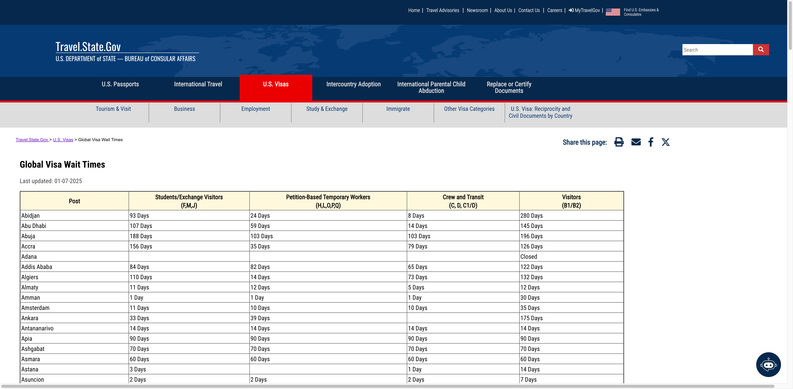
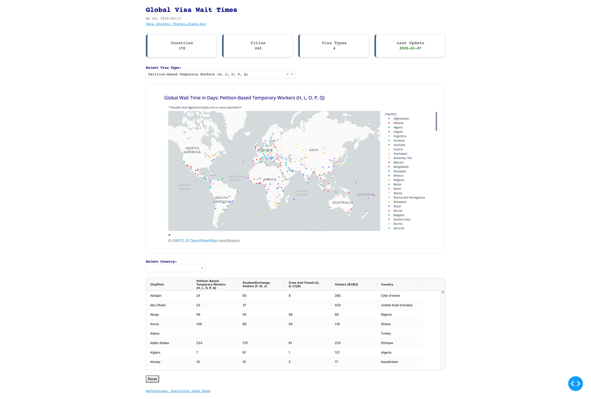

## visa-wait-time

This repo builds a small data application to **interactively** visualize the global wait times for US Visa that was published on [Travel.State.Gov](https://travel.state.gov/content/travel/en/us-visas.html) website.  
*Note: [the website](https://travel.state.gov/content/travel/en/us-visas/visa-information-resources/global-visa-wait-times-DEACTIVATED.html) was depreciated as of March 7th, 2025*

April 2025 Update: Added employer-based immigration wait-time that was published on [Travel.State.Gov](https://travel.state.gov/content/travel/en/legal/visa-law0/visa-bulletin/2025/visa-bulletin-for-april-2025.html) and [FLAG.DOL.GOV](https://flag.dol.gov/processingtimes) website.

>

The app is mainly within `Plotly Dash` framework with helper packages `dash-bootstrap-components` and `dash-ag-grid`. It provides a scatter map plot to show geography of the cities by visa types as well as an AG grid table to populate the data.  
The data for country mapping and city geo location was from [*simplemaps World Cities Database*](https://simplemaps.com/data/world-cities). The required dependencies are in [*requirements.txt*](requirements.txt).

>**Demo:**
>

There is a [deployed App](https://visa-wait-time-92237e1d0c27.herokuapp.com/) hosted on Heroku Cloud for access.

